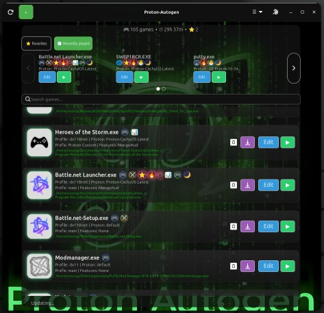

# 🧩 Proton-Autogen


**Proton-autogen automatically creates and configures Proton environments for Windows games and applications, applying optimized settings for the best compatibility.**
**Proton-autogen is a lightweight Proton/Wine orchestration layer that allows Linux users to run Windows applications from `.exe` files without manually managing Steam shortcuts or Wine prefixes.**


Run Windows executables through Proton with zero Steam configuration.
---
🎬 Quick Demo
<p align="left">
  
  
</p>


## 🚀 Overview

Proton-Autogen automatically detects available Proton installations, configures the required runtime environment, and launches Windows applications using Proton with Wine fallback support.

No manual Steam shortcut creation or prefix configuration is required.

Simply:

* Right-click a `.exe`
* Select **Open with Proton-Autogen**
* Launch the application

---

## ✨ Features

* ▶ Run Windows `.exe` files directly via Proton
* 🧠 Automatic Proton detection
* 🚀 Support for Proton-CachyOS, GE-Proton and custom Proton builds
* 🍷 Wine fallback support
* 📦 Prefix management
* 🖱️ File manager integration : Nemo, Nautilus, Dolphin
* 🎮 Game/application profiles
* 🖥️ GTK4 graphical interface
* 🛠️ Diagnostic tools
* ⚙️ CLI and advanced options
* 🔧 Lightweight and dependency-minimal

See an example of generated profiles here: [Profile Output Example](docs/profiles.md)

---

## 📸 Screenshots


### Integration
Right-click any Windows executable and select:

```text
Open with Proton-Autogen
```

---

## 🧪 Usage

### Terminal

```bash
proton-autogen game.exe
```

### Graphical interface:

```bash
proton-autogen --ux
```

## 🛠️ Troubleshooting

If an application does not launch, generate a diagnostic report:

```bash
proton-autogen --diag
```
### Example Output:
See the full example output here: [Example Output](docs/examples.md)


---
## 📦 Downloads

Latest releases are available on GitHub:

- Debian / Ubuntu: `.deb` package
- Source installation: `install.sh`
- Arch Linux / CachyOS: AUR (coming soon)


## 📦 Installation & Updates

### Ubuntu / Linux Mint / Pop!_OS (Recommended)

The recommended installation method is the official Proton-Autogen PPA:

For Arch Linux and CachyOS, a native package is planned.
Until then, the manual installer is available.

### Recommended installation (Ubuntu / Linux Mint / Pop!_OS)

```bash
sudo add-apt-repository ppa:n3oray/proton-autogen
sudo apt update
sudo apt install proton-autogen
```

### Debian / Ubuntu-based distributions (.deb package)

Download the latest `.deb` release from GitHub:
```bash
sudo apt install ./proton-autogen_*.deb
```
### Build Debian package manually

```bash
git clone https://github.com/N3oRay/proton-autogen.git
cd proton-autogen
dpkg-buildpackage -b -us -uc
sudo apt install ../proton-autogen_*.deb
```

### See the manual installation guide:
[Installation Guide](docs/install.md)


Review the installer before running it
```bash
less install.sh
```
### (install manual)
```bash
git clone https://github.com/N3oRay/proton-autogen.git
cd proton-autogen
chmod +x install.sh
./install.sh
```


### Config
The configuration is fully automatic.
```bash
cat ~/.config/proton-autogen/proton-autogen.conf
ls ~/.config/proton-autogen/games
```


This installs:

* `/usr/bin/proton-autogen`
* Integrated with Nemo (Cinnamon), Nautilus (GNOME), and Dolphin (KDE Plasma).

---

## ⚠️ Requirements

### Required

* Python 3.x
* A working Proton installation

Supported locations:

```text
~/.steam/root/compatibilitytools.d
~/.steam/debian-installation/compatibilitytools.d
~/.local/share/Steam/compatibilitytools.d
```

### Optional

- GameMode
- MangoHud
- GameScope
- Proton-CachyOS
- GE-Proton
- ProtonUp-Qt
```bash
sudo apt install gamemode mangohud
```
---

## 🧠 How It Works

1. Detect available Proton installations
2. Prefer GE-Proton when available
3. Launch executable through Proton
4. Fall back to Wine if Proton runtime tools are unavailable
5. Optionally enable GameMode

No Steam shortcut creation is required.

---

## 🗑️ Uninstallation

### Remove Package

```bash
sudo apt remove proton-autogen
```

### Full Cleanup

```bash
sudo apt purge proton-autogen
```

### Manual Cleanup

```bash
chmod +x ./uninstall.sh
./uninstall.sh
```
The uninstall script only removes Proton-Autogen files and configuration.
It does not remove Steam, Proton versions, or existing Wine prefixes.

Restart Nemo:

```bash
nemo -q
```

Restart Nautilus:

```bash
nautilus -q
```

---

## 🚧 Known Limitations

* Not every Windows application works under Proton
* Some launchers require additional configuration
* Proton compatibility depends on the selected Proton version
* Certain applications may still require Wine tweaks

---

## 🛣️ Roadmap
### Core features

- [x] Per-application profiles
- [x] Advanced prefix control (Steam compatdata integration)
- [x] Configuration file support
- [x] Game / Installer auto-detection
- [x] GUI frontend

### Gaming integrations

- [x] Lutris profile export
- [ ] Lutris profile import
- [ ] Bottles profile import/export
- [x] Sensors and MangoHud support
- [x] Gamescope integration

### Automation

- [ ] ProtonDB integration
- [ ] Automatic dependency installation (.NET, VC++, DirectX...)
- [ ] Silent mode

---

## 🤝 Contributing

Bug reports, feature requests, and contributions are welcome.

Please use GitHub Issues for discussions and reports.


## 💡 Philosophy

Linux gaming is powerful but often fragmented.

Proton-Autogen aims to reduce friction by turning Proton into a transparent execution layer rather than a manually configured tool.

The goal is simple:

> Right-click → Run Windows application → It just works.

---

## 👤 Author

**N3oray**


GitHub: [@N3oRay](https://github.com/N3oRay)

---

## 📜 License

This project is licensed under the MIT License.

See the `LICENSE` file for details.


## 📈 Project Activity

<sub>
Actively maintained and used by Linux users, with regular releases and ongoing improvements.
</sub>

```markdown
📦 Clones             ████████████████████  2,091
👥 Unique cloners     ████████              509
👀 Views              ██████                393
🌍 Unique visitors    ██                    157
Ubuntu PPA
📥 Downloads █████████████████████  301
```
<sub>
Launchpad downloads represent PPA package downloads, not unique users.
</sub>
